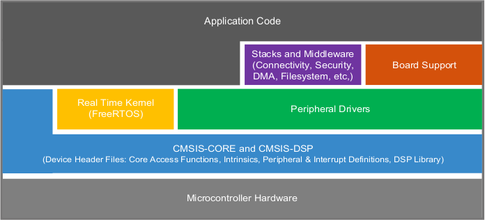

VAR-SOM-MX93 - MCUXpresso 2.13.1
===================================
Overview
--------

MCUXpresso SDK
~~~~~~~~~~~~~~

MCUXpresso SDK board support provides example applications for NXP development and evaluation boards for Arm Cortex-M cores. Board support packages are found inside of the top level boards folder, and each supported board has its own folder (MCUXpresso SDK package can support multiple boards). Within each <board_name> folder there are various sub-folders to classify the type of examples they contain. These may include (but are not limited to):

    - cmsis_driver_examples: Simple applications intended to concisely illustrate how to use CMSIS drivers.
    - demo_apps: Full-featured applications intended to highlight key functionality and use cases of the target MCU. These applications typically use multiple MCU peripherals and may leverage stacks and middleware.
    - driver_examples: Simple applications intended to concisely illustrate how to use the MCUXpresso SDK’s peripheral drivers for a single use case.
    - rtos_examples: Basic FreeRTOS OS examples showcasing the use of various RTOS objects (semaphores, queues, and so on) and interfacing with the MCUXpresso SDK’s RTOS drivers.
    - multicore_examples: Simple applications intended to concisely illustrate how to use middleware/multicore stack.

Here we describe how to use ARM GCC toolchain, officially supported following Getting Started with MCUXpresso SDK for MCIMX93-EVK.pdf.

Prerequisites
~~~~~~~~~~~~~
Before starting, prepare a Yocto boot SD (with kernel 6.1.1 or newer).

To allow the Cortex-M33 to access shared resources without experiencing Linux kernel conflicts, a dedicated device tree must be loaded, by selecting the right version with the symbolic link in the /boot folder of the booting media.
These device trees contain **m33** label in their name.

The below table lists an example dtb blob file name for VAR-SOM-MX93 (on the Symphony Board) with support for the M33 for each kernel version / Yocto release: 

.. list-table::
   :widths: 50 50
   :header-rows: 1

   * - File Name
     - imx93-var-som-symphony-m33.dtb
   * - Description
     - VAR-SOM-MX93 device tree blob for kernel = 6.1.1 (Yocto Langdale) on Symphony-Board 1.4a and above.

This device tree disables some of the base device tree nodes in order to avoid conflicts between the Cortex-A55 processors and Cortex-M33.

For the full list of device tree blob files, refer to the "Build Results" section in the appropriate wiki page for the specific Yocto/Debian release you are using. 

Installing required packages
~~~~~~~~~~~~~~~~~~~~~~~~~~~~
Install cmake:

.. code-block:: console

  $ sudo apt-get install cmake

Download and install GNU-ARM bare-metal toolchain:

.. code-block:: console

  $ mkdir ~/var-mcuxpresso
  $ cd ~/var-mcuxpresso
  $ wget https://developer.arm.com/-/media/Files/downloads/gnu-rm/10.3-2021.10/gcc-arm-none-eabi-10.3-2021.10-x86_64-linux.tar.bz2
  $ tar xvf gcc-arm-none-eabi-10.3-2021.10-x86_64-linux.tar.bz2

Download MCUXpresso SDK for the SOM:

.. code-block:: console

  $ cd ~/var-mcuxpresso
  $ git clone https://github.com/varigit/freertos-variscite -b mcuxpresso_sdk_2.13.x-var02
  $ cd freertos-variscite

Documentation
~~~~~~~~~~~~~
Original NXP documentation is available online or in the following folder:

.. code-block:: console

  ~/var-mcuxpresso/freertos-variscite/docs

Demo Pins
~~~~~~~~~
Default M33 pins used by the demos are:

.. list-table::
   :header-rows: 1

   * - Function
     - SoC balls
     - VAR-SOM-MX93 Pins
     - Symphony Pins
     - Notes
   * - UART7 RX/TX
     - M21 / M20
     - J1.175 / J1.124
     - J18.5 / J18.3
     -
   * - TPM6-CH3 - PWM Output or Input Capture
     - W21
     - J1.69
     - J18.2
     -
   * - CAN1 RX/TX
     - J17 / G17
     - J1.46 / J1.44
     - J16.18 / J16.20, CANL/CANH levels (CAN transceiver mounted!)
     - If enabled, CAN devices will no longer visible from Linux